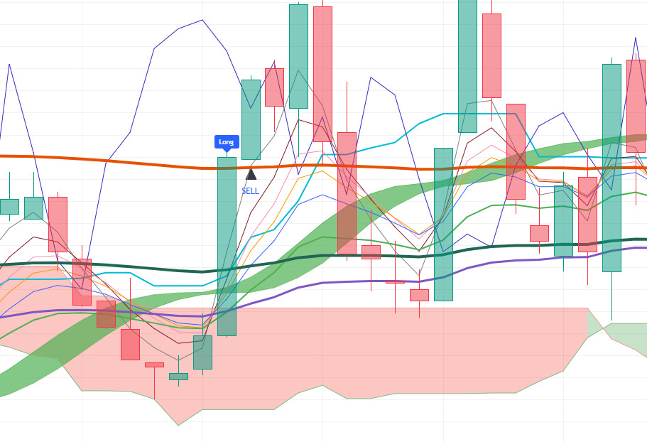

# Pine-Script-Use-Method-Indicator
Indicator based on multi-timeframe EMAs, RSI, MACD, Ichimoku, and Hull Suite with a modular "Use" toggle architecture. Signals entry for long/short in futures for any cryptocurrency on Trading View.

--

## Chart Preview

--

## Motivation & Problem

- **Market Noise & Inflexible Indicator Stacks**: Traditional multi-indicator systems often suffer from rigid logic, in which a suboptimal filter produces false negatives or blocks valid trades under changing market conditions.
- **The Core Goal**: To create a flexible, highly modular indicator by implementing the "Use" feature, allowing users to selectively activate or bypass individual technical filters (EMA ribbons, RSI, MACD, Ichimoku, Hull Suite) while preserving strict multi-timeframe momentum confirmation.

--

## Strategy Logic & Architecture

- This indicator avoids false signals and wrong interpretation of the trend by utilizing a **rule-based, multi-factor filtering system**:

### Core Components:
1. **Trend & Ribbon Filters (EMA, Hull Suite, Candle Open)**:
  - Uses a 10-period EMA ribbon across multiple timeframes (3m and 1m) to detect trend direction and crossover events (e.g., fast EMAs crossing EMA 20 or EMA 100).
  - Hull Suite band and 30-minute candle open comparison (AboveHour / BelowHour) confirm alignment with macro price direction.
  - Ichimoku conversion line slope confirms short-term trend, while 1-minute MACD monitors zero-line momentum.

2. **The "Use" Feature & Multi-Timeframe RSI**:
  - Introduces dynamic boolean switches (UseEMA1to10, UseRSI, UseMACD, UseIchimoku, UseHullSuite) to toggle each individual filter on or off without editing the script.
  - Pulls multi-timeframe RSI data using 'request.security()' to confirm momentum alignment above 55 or below 45 across multiple lengths (7, 9, 12).

3. **Execution Rule**
  - **Bullish Signal**: Triggers when EMA 1-10 crossover occurs (if enabled) and multi-timeframe RSI is aligned above 55 (if enabled) and 1-minute MACD is above zero (if enabled) and Ichimoku conversion line slopes upwards (if enabled) and price is above Hull Suite (if enabled) and 1-minute fast EMA crosses up and price is above the 30-minute candle open in a 3-minute timeframe.
  - **Bearish Signal**: Triggers when EMA 1-10 crossdown occurs (if enabled) and multi-timeframe RSI is aligned below 45 (if enabled) and 1-minute MACD is below zero (if enabled) and Ichimoku conversion line slopes downwards (if enabled) and price is below Hull Suite (if enabled) and 1-minute fast EMA crosses down and price is below the 30-minute candle open in a 3-minute timeframe.

--

## Configurable Parameters

Users can adjust the following parameters inside TradingView's settings panel:

- **EMA Length**: Default - 3, 5, 7, 9, 12, 20, 30, 60, 100, 200. Lookback periods for the EMA ribbon.
- **RSI Time Frame & Length**: Default - 3m timeframe, lengths 7, 9, 12. Lookback periods for RSI confirmation.
- **MACD Time Frame**: Default - 1. Lookback timeframe for the MACD line.
- **Conversion Line Length**: Default - 9. Lookback period for Ichimoku conversion line.
- **Hull Suite**: Default - HMA length 55, 240m HTF. Lookback period and timeframe for Hull Suite band.

--

## How to Install & Use in TradingView

1. Open any crypto chart (e.g., `BTC/USDT`) on **[TradingView](https://www.tradingview.com/)**.
2. Open the **`Pine Editor`** console at the bottom of the page.
3. Open `indicator.pine` from this repository, copy the source code, and paste it into the editor.
4. Click **`Save`** and then click **`Add to Chart`**.
5. Click the gear icon (`Settings`) on the indicator to adjust parameters as needed.

--

## Key Learnings & Engineering Reflections

1. **Modular Filter Control Using the Ternary Operator (x ? y : true)**
  - I learned that using the ternary operator (x ? y : true) allows effortless toggling of individual conditions. If x (Use toggle) is true, the script evaluates y (the filter condition); if x is false, it returns true as a pass-through bypass. This makes the strategy fully modular without breaking the compound boolean logic.

2. **Multi-Timeframe Macro Baseline from Candle Open**
  - I learned that comparing the current price against higher-timeframe candle open prices (such as 30m and 1H) via 'request.security()' provides a reliable directional baseline. This helps filter out noisy counter-trend trades during lower-timeframe fluctuations.
